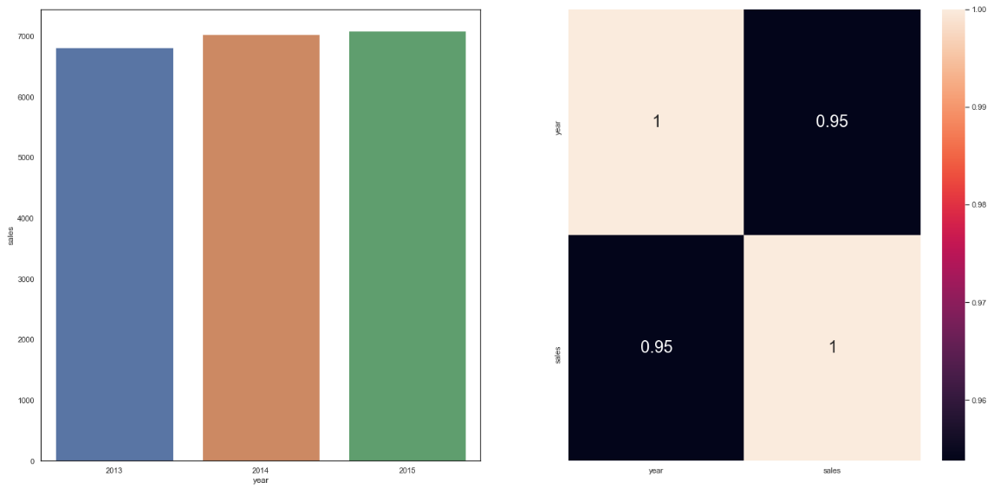
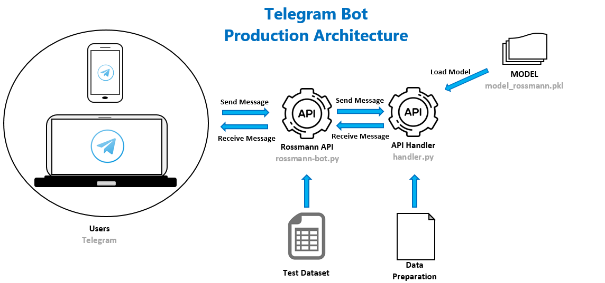

# ROSSMANN Sales Forecasting: An End-to-End Data Science Project Using Machine Learning for Predictions

⚠️ I'm still building this ReadME ⚠️

---
## Contents 

- <a href="#intro">A Brief Introduction to the ROSSMANN Company</a>
- <a href="#crisp">Project Methodology: CRISP-DM</a>
- <a href="#p1">Phase 1: Business Understanding</a>
  - <a href="#buss">The Business Context</a>
- <a href="#p2">Phase 2: Data Understanding</a>
    - <a href="#s1">Step 1: Data Collection and Description</a>
    - <a href="#s2">Step 2: Hypothesis Creation and Feature Engineering</a>
    - <a href="#s3">Step 3: Filtering Variables and Rows</a>
    - <a href="#s4">Step 4 Exploratory Data Analysis (EDA)</a>
            - <a href="#hps">Hypothesis Validation Summary</a>
- <a href="#p3">Phase 3: Data Preparation</a>
    - <a href="#s5">Step 5: Data Preparation</a>
    - <a href="#s6">Step 6: Feature Selection</a>
- <a href="#p4">Phase 4: Modeling</a> 
    - <a href="#s7">Step 7: Machine Learning Modeling</a>
    - <a href="#s8">Step 8: Hyperparameter Fine Tuning</a>
- <a href="#p5">Phase 5: Evaluation</a> 
    - <a href="#s9">Step 9: Translating and Interpreting the Error</a>
- <a href="#p6">Phase 6: Deployment</a> 
    - <a href="#s10">10. Deploying Machine Learning Model to Production: a telegram bot</a>
- <a href="#conclusion">Conclusion</a>

--- 
## A Brief Introduction to the ROSSMANN Company 

This is based on the ROSSMANN company portrait available on [the company website](https://www.rossmann.de/unternehmen/ueber-uns/unternehmensportrait.html)

Dirk Rossmann GmbH is one of the largest drug store chains in Europe and the largest in Germany in 2020 ([see list](https://www.statista.com/statistics/505614/number-of-drugstore-branches-germany/)). The retail company, founded by Dirk Roßmann in 1972 in Germany, operates over 3,000 drug stores in 7 European countries. The company is increasing the number of stores outside of Germany over the last years, as shown by [this chart](https://www.statista.com/statistics/1009654/number-of-rossmann-stores-by-country/).

With more than 4,000 branches (2,196 of them in Germany), the company operations extend to Albania, Czech Republic, Hungary, Poland, and  Turkey. The foreign companies contributed 30 percent to group sales.

The group started the year of 2020 intending to open 200 new branches and intended to maintain the rate of expansion (a volume of investiment of 200 million euros).

ROSSMANN has around around 21,700 different items with a focus on skin and body care, food and luxury foods, baby, detergents, cleaning and hair care.

<a href="#contents">Back to Contents</a>

---
## Project Methodology: CRISP-DM 

The method used manage the project was the Cross-Industry Standard Process for Data Mining (CRISP-DM). This is one of the most used techniques for Data Science Projects. 

As said by [Wirth and Hipp](http://www.cs.unibo.it/~danilo.montesi/CBD/Beatriz/10.1.1.198.5133.pdf), "the CRISP-DM reference model for data mining provides an overview of the **life cycle** of a data mining project". This process allows us to iterate over the steps and we can map all possible problem in the project.

Aiming to provide more productivity and effectiveness, the Data Science project is broken in six phases: Business Understanding, Data Understanding, Data Preparation, Modeling, Evaluation, and Deployment.

### CRISP-DM Cycle

The main reason why CRISP-DM was used is because it has four main advantages:

* for each complete cycle, we have and end-to-end solution that can be implemented and attend some of business demands;
* it provides a more quickly business results than many others methodologies;
* we can map many problems and antecipate impediments and avoid them;
* it helps us not to spend to much time on a particular step.

In this project, the CRISP-DM phases is broken into 10 steps: Business Understanding, Data Description, Feature Engineering, Filtering Variables, Exploratory Data Analysis, Data Preparation, Feature Selection, Machine Learning Modeling, HyperParameters Fine Tuning, Translating and Interpreting the Error, and the Model Deployment.

Merging the phases and the steps we have:

#### Phase 1: Business Understanding
Correctly identify and understand the business demand objectives and the requirements from a business perspective. This understanding has to be deeper, identifying the true stakeholder and reason of the request.

* **Step 0: Business Demand**

#### Phase 2: Data Understanding
It starts with the data collection and then with activities in order to get familiar with the data, to identify data quality problems, to discover some initial insights into the data, and/or to detect interesting subsets to form hypotheses for hidden information.

* **Step 1: Data Collection and Description**
* **Step 2: Hypothesis Creation and Feature Engineering**
* **Step 3: Filtering Variables and Rows**
* **Step 4: Exploratory Data Analysis**

#### Phase 3: Data Preparation
This phase aims to prepare the data for modeling.

* **Step 5: Data Preparation (transforming, scaling, ...)**
* **Step 6: Feature Selection**

#### Phase 4: Modeling
Build Machine Learning models and compare them based on Cross validation technique. After that, choose the best one and tune its parameters.

* **Step 7: Machine Learning Modeling**
* **Step 8: Hyperparameter Fine Tuning**

#### Phase 5: Evaluation
Evaluate the model results with some appropriate metrics. Besides that, translate that metrics to the business field.

* **Step 9: Translating and Interpreting the Error**

#### Phase 6: Deployment
Create the model and evaluate it is not usually the end of the project. The results have to be deliver or presented to the stakeholders. So, that's what this phase is about.

* **Step 10: Deploying the Machine Learning Model to Production: a telegram bot**

#### Next Cycle
After completing all these phases, we have a solution (even though it cannot be the best) to satisfy the initial business demand. After that, we evaluate the project outcome, the business needings, and then decide if there's need to continue with more cycle. If so, all the steps is done again in order to improve the model.

[back to contents](#contents)

---
## Phase 1: Business Understanding 

Before starting the data analysis and modeling, the first task is to understand the business problem we received as a data scientist. That's important because there's a big chance that the request we received is not exactly what the stakeholder wants (_and sometimes the person who made the request for us is no the true stakehold. In that case, we also have to identify who really is the stakeholder_).

For that goal, we need to seek to understand four things:
1. The context behind the business request: how did it come about?
2. The reason the person is making the request;
3. Who is the main stakeholder of the request. If is someone other than the managers, maybe the request is not exactly that we received; Besides that, the main stakeholder can guide us in the project;
4. The solution format:
      - granularity: daily, weekly, by stores, by product, and so forth;
      - What kind of machine learning problem it is: classification, regression, clustering, and so on;
      - Main methods that could be used: time series, SMV, RNA, and so on;
      - presentation method: dashboard, mail, smartphone message, and so on.

### The Business Context 

⚠️⚠️ _Disclaime:_ Since we don't work for ROSSMANN and we have only the dataset, it'll be helpful to create a hypothetical business context to guide the project. The following context is basically a mix between the <a href="https://www.kaggle.com/c/rossmann-store-sales/data">Rossmann description and request of the dataset on Kaggle</a> and some additions from the <a href="https://www.hotmart.com/product/data-science-em-producao/Y24207977W">Data Science em Produção</a> course.
So, let's pretend we work as data scientists for ROSSMANN.

Our Data Science team received the request from the store managers to forecast the sales for its respective stores for the next six weeks. Before starting to handle the data, our team decided to better understand that business request. We found that in fact the request came up from the CFO who asked the managers for the predictions of the stores revenue for the next six weeks because he wanted to reform the stores and he wanted to aticipate the store amount of sales after six weeks as the investment.

So, our team started to understand that four things that was said before:
- **The business request context:** In a monthly meeting, the CFO requested the managers the next six weeks sales predictions for each store;
- **The reason behind teh request:** the CFO wants to anticipate a portion of the stores revenue to invest in the stores reformation;
- **Stakeholder:** CFO
- **The Solution format:**
    - **Granularity:** daily sales by stores;
    - **Kind of problem:** Sales Forecast;
    - **Main methods:** Regression, Time Series;
    - **Delivering Method:** Real-time six weeks sales forecasting in a smartphone app.

[back to contents](#contents)

---
## Phase 2: Data Understanding 

After better understand the business demand, our team could start handling with data. As said before, this phase involves loading, cleaning, applying descriptive statistics, and exploring the data. This phase comprises steps one through four.

### Step 1: Data Collection and Description 

In this step we can see how challenging is the problem we are dealing with. 

#### Data Collection
In a real-life project, this step starts with requests on databases, APIs, and so on in order to collect all the information available that could help us solve the problem. With that in hand, our team can create a final dataset. Since this project works with data from Kaggle, our first task in this step is just to load the csv dataset.

The data is from <a href="https://www.kaggle.com/c/rossmann-store-sales/data">Rossmann Store Sales on Kaggle</a>. There's three main datasets:
- Training Data: historical data for training the model (it includes the target: sales)
- Test Data: historical data for testing the model (it includes the target: sales)
- Store Data: supplemental information about the stores

#### Training Data Dimensions:

    - Number of Rows: 1,017,209
    - Number of Columns: 18
    - Date Range: from 2013-01-01 to 2015-07-31

#### Variables Description and types:
table from [this repository](https://github.com/alanmaehara/Sales-Prediction)

| Variable      | Description | Data Type |
| ----------- | ----------- | ----------- |
| **sales** (target)  | **the turnover for any given day (this is what you are predicting)** | **numerical (continuous)**   |
| store   | Store ID (unique) | numerical (discrete)  |
| day_of_week   | day of the week (1 = Monday, 7 = Sunday) | numerical (discrete)    |
| date  | date of each sales entry | date  |
| customers  | the number of customers on a given day  | numerical (discrete) |
| open   | an indicator for whether the store was open: 0 = closed, 1 = open | numerical (dummy)  | 
| promo  | indicates whether a store is running a promo on that day | numerical (dummy)   |
| state_holiday   | indicates a state holiday. Normally all stores, with few exceptions, are closed on state holidays. Note that all schools are closed on public holidays and weekends. a = public holiday, b = Easter holiday, c = Christmas, 0 = None | categorical (nominal)  |
| school_holiday  | indicates if the (Store, Date) was affected by the closure of public schools: 1 = affected, 0 = not affected | numerical (dummy*)  |
| store_type   | differentiates between 4 different store models: a, b, c, d | categorical (nominal)  |
| assortment | describes an assortment level: a = basic, b = extra, c = extended | categorical (ordinal)  |
| competition_distance   | distance in meters to the nearest competitor store | numerical (continuous)   |
| competition_open_since_month  | gives the approximate month of the time the nearest competitor was opened | numerical (discrete)  |
| competition_open_since_year   | gives the approximate year of the time the nearest competitor was opened | numerical (discrete) | 
| promo2  | promo2 is a continuing and consecutive promotion for some stores: 0 = store is not participating, 1 = store is participating | numerical (dummy)  |
| promo2_since_week   |describes the calendar week when the store started participating in Promo2 | numerical (discrete) |
| promo2_since_year   |describes the year when the store started participating in Promo2 | numerical (discrete) |
| promo_interval   |describes the consecutive intervals Promo2 is started, naming the months the promotion is started anew. E.g. "Feb,May,Aug,Nov" means each round starts in February, May, August, November of any given year for that store | categorical (nominal) |

#### Data Cleaning: Imputation and Changing Types
Along the this step, our team identified some missing values and some inappropriate data types. It's important to deal with them because many Machine Learning algoriths can't deal with such problem.  
First, we changed teh 'date' columsn type from object to pandas datetime using the `.astype()` function.

Second, we dealt with the missing data. We identified the following columns with missing values:

| Variable      | NANs |
| ----------- | ----------- | 
| competition_distance | 2642
| competition_open_since_month | 323348
| competition_open_since_year | 323348
| promo2_since_week | 508031
| promo2_since_year | 508031
| promo_interval | 508031

The first task after identifing those NANs would be to try to discover why there are missing values in the data set. In a real-life context, we would have talked to the data engineering team to better identify the reason of the existence of the missing data. Also, it could be a mistake when collecting the data. Since in this fictional project there's no one who could give us information, we cannot know exactly the reason for those NANs. Thus, the next step is to handle it.

There are some techniques to deal with missing values, like input the column mean, drop the rows or the columns, and the use of Machine Learning algoriths to predict the value. However, we tried to input variables based on the business understanding, using other columns the derive a value. Since we are working in CRISP-DM cycles, we could better handle it in the next one. Due to the high number of missing values, the traditional methods could not be so good because if we drop of input the mean we could lose information.

The inputation was as follow:
- **competition_distance:** maybe null values indicates that thre're no competitors next. So, we inputed a value grater thatn the maximum distance in the column. Since the maximum is 75,860m, we inputed 200,000m to the missing data;
- **competition_open_since_month** and **competition_open_since_year**: for both, it was inputed the year from the column `date`;
- **promo2_since_week** and **promo2_since_year**: if there are missing values in these columns, maybe it's because the store is not participating in promo2. So, we'll fill it out with the present date.
- **promo_interval:** I'm going to create the column `is_promo` (dummy variable) to indicate whether a store is holding consecutive promo sales on that day and the `promo_interval` will be dropped in Step 3.

#### Descriptive Statistics
To summarize the data, we used the descriptive statistics. We devided the dataset between numeric and categorical variables and performed the respective statistics techniques.

For **numerical variables**, we basically used the central tendency (mean and median) and the dipersion (Standard Deviation, Minimum, Maximum, Range, First and Third Quartiles, Skewness, and Kurtosis) measures. 

Two columns are highly skewd: `competition_distance` and `competition_open_since_year`. Besides that, `competition_distance` is too large, which can indicates the presence of outliers.

Since there's no much technique to analyze categorical data, we used boxplots for them and sales.

It seems that sales tends to differ between store types and the assortment level. 

### Step 2: Hypothesis Creation and Feature Engineering 

To better understand the relationship between the target variable (sales) and the features, we created some hypothesis based on the business problem to guide the feature engineering and then the exploratory data analysis.

The hypothesis created in this step will be validated in the Exploratory Data Analysis step. It let us have a good notion about the relation between the features and the target and it will help us to choose more accurately what feature to use when modeling.

#### Hypothesis Mind Map
to guide the hypotehsis creation, the following mind map was created. The Hypothesis Mind Map has basically three elements:
- The phenomenon: it's what we want to measure or model (sales);
- Agents: entities that somehow impact the phenomenon 9customers, stores);
- Agent's Attributes: age, marritage, size, and so on.

-> Mind Map goal: derive a list of hypotheses and then we can prioritize some of them

#### Hypothesis Creation 

After creating a hypothesis list, we prioritize some over others. The criterion used was the availability of the corresponding feature.

**Hypothesis Final List**
1. Stores with a larger assortment should sell more.
2. Stores with closer competitors should sell less.
3. Stores with longer competitors should sell more

4. Stores with active promotions for longer should sell more.
5. Stores with more promotion days should sell more.
6. Stores with more consecutive promotions should sell more.

7. Stores open during the Christmas holiday should sell more.
8. Stores should be selling more over the years.
9. Stores should sell more in the second half of the year.
10. Stores should sell more after the 10th of each month.
11. Stores should sell less on weekends.
12. Stores should sell less during school holidays.

#### Feature Engineering
First of all, why do we need to do it and why to do it before the EDA? 
- To have the variables available to study in the exploratory data analysis;
- To don’t have a mess in the EDA section with feature creation, maps, tables, more maps. That is, to have a clean code with feature creation and exploratory analysis in different sections.

We created the following features:
- from `date` column we created `year`, `month`, `day`, `week_of_year`, and `year_week` since we need them to validate some hypothesis;
- `competition_since`: it stands for how long the competition exists considering the purchase date in terms of months. ;
- `promo_since`: how long is there an active promotion.

Some categorical featured had their attribute classes renamed: `state_holiday`, `assortment` was just letters and then became descriptions (like 'a' in state holiday that became 'public_holiday').

Since `store_type` had no description in the data source, it wasn't changed
.
### Step 3: Filtering Variables and Rows 

Based on business restrictions (e.g. we won't have a variable avaliable in the future to use in the prediciton), we have to properly filter variables.

This step is divided into two partes: Filtering Rows and Filtering Columns.

**Filtering Rows:** since it's obvious that closed stores has no sales in that day, we dropped rows where `open` is equals to zero. Also, we considered only the rows where `sales` is greater than zero.

**Filtering Columns:**
- `customers`: we can't use customers because we won't have this data available for the next six weeks (the prediction period) unless we build another project to predict how many customers the stores will have in that period;
- `promo_interval` and `month_map` were used to create new columns. They'll not be used anymore.
- since `open` has no use anymore, we dropped it.

### Step 4: Exploratory Data Analysis (EDA)

In this step we go deeper in the data to get some valuable business insights. Basically, we want to know which variables is the most important to the prediction and what is the strength of that importance.

The EDA is divided into three parts
1. Univariate Analysis: to get a overview of the individually variables, looking at their distribution and counting classes for categorical features;
2. Bivariate Analysis: check the relationship between the features and the target based on the <a href="#hyp">Hypothesis list</a>. This is one of the most important steps, which we can get some business insights and decide if the feature is really important to the model.
3. Multivariate Analysis: check the relationship between the features and identify those highly correlated.

#### Univariate Analysis
It's divided into Response, Numerical, and Categorical analysis.

- **Response Variable (sales):** the target distribution seems to be non Normal. Since the majority of Machine Learning algorithms needs the target to be normal, we checked that by using both Q-Q plot and Shapiro-Wilk test for normality. As shown bt the Q-Q plot bellow, the distributions don't seems to be follow a normal distribution. Shapiro-Wilk test (statistics = 0.902; p-value = 0.000) confirms that it is probably non Gaussian. Therefore, we'll have to rescale it before performing the model.

- **Numerical Variables:** all variables seem not to be normal. Some Highlights: 

        - `day_of_week`: sales are lower on Sundays;
        - `competition_distance`: the are more stores with competitors close than far;
        - `promo2_since_year`: there are more stores that joined consecutive promotion sales in 2013.
        

- **Categorical Variables:** 
    - `state_holiday`: There's a difference for the three types of holiday. Based on that difference, the model could better adjust its predictions. For instance, it's christmas period;
    - `store_type`: for different type of stores, sales have a different behavior. For instance, store of type b have sales less concentrated than the others;
    - `assortment`: there are fewer sales for stores with 'extra' assortment than with the other classes.

#### Bivariate Analysis
In this task, those hypothesis was validated one by one. As said before, what we basically did was:
    - validate the hypothesis;
    - conclude if the feature is important to use in the model;
    - get some business experience.

##### H1: Stores with a larger assortment should sell more 
This hypothesis is about the variable `assortment`. We have no much information about this feature, only that it has three classes: basic, extended and extra. The counting for each one is as follows:
    - basic: 444875
    - extended: 391254
    - extra: 8209
since there's a difference in quantity between all three classes, we used the average as a comparison (not the sum). Furthermore, I'll concentate in 'basic' and 'extended' which are two extremes of the feature.

**Conclusion**: **FALSE.** 
On average, sales seem to increase as the assortment is bigger. Also, analysing over the weeks, we can see that 'extended' and 'basic' moves quite similar.

##### H2: Stores with closer competitors should sell less 
This hypothesis is about the variable `competition_distance`. It is the distance in meters to the nearest competitor store.

**Conclusion**: **FALSE.** 
stores with closer competitors sell more. Competition distance and sales have a negative non linear correlaiton, which means that as the distance increases, sales decrease. That correlation (-0.23) is good enough to consider the variable important to the model.

##### H3: Stores with longer competitors should sell more* 
Here it is analyzed the `competition_time_month`. 

**Conclusion**: **FALSE.** 
the more recent the competition, the higher the sale. The feature is relevant to the model because its correlation with the target is not too close to zero.

##### H4: Stores with active promotions for longer should sell more  
To validate this hypothesis it was used the column `promo_time_week`. It measure how long, in terms of weeks, a promotion is active.

**Conclusion**: **FALSE.** 
stores with active promotions for longer sell less because sales starts to decrease after a period of time. According to the correlation, there's no evidence of a strong relationship between this feature and the target

##### <s>H5: Stores with more promotion days should sell more </s>   
Our team decided to validatethis hypothesis in the second CRISP cycle.

##### H6: Stores with more consecutive promotions should sell more 
This hypothesis analyses `promo` and `promo2` in term of weeks of the year (`year_week`).

**Conclusion**: **FALSE.**  
Stores with more consecutive promotions sell less. Since both levels moves quite similar, there's no such an evidence of a strong relationship between this feature and the target.

##### H7: Stores open during the Christmas holiday should sell more 
Here it's analyzed the `state_holiday`. 

**Conclusion**: **FALSE.** 
On average, stores open during christmas have one of the highest sales amount, but easter holiday has a higher mean. In fact, stores sell more during holidays than during regular days. So, this feature can be considered important to the analysis.

##### H8: Stores should be selling more over the years 
Here it is analyzed the `year` column.

**Conclusion**: **TRUE.** 
On average, sales are increasing over the year. Since the correlation is very high, this feature is important to the model.

##### H9: Stores should sell more in the second half of the year 
Since 2015 is incomplete, we used the mean instead of the sum to compare because the lack of data for the second half of the year could give us misinformation.

**Conclusion**: **FALSE.** 
Stores sell less in the second half of the year. The feature and the target have a strong negative correlation and it can be considered important to the model.

##### H10: Stores should sell more after the 10th of each month

**Conclusion**: **FALSE.** 
On average, there's no such a strong evidence that stores sell more after the 10th day of each month. In fact, the mean for this class is slightly smaller than for 'before_10_days'. The correlation between the feature and the target shows a relevant relationship. thus, It can be considered important to the model.

##### H11: Stores should sell less on weekends 
Since there was less sundays in the dataset, we used the mean to compare the sale by days.

**Conclusion**: **FALSE.** 
on average, I can't say that sales is less on weekends. The correlation is strong enough to be considered in the model.

##### H12: Stores should sell less during school holidays 

**Conclusion**: **FALSE.** 
there's no such an evidence that stores sell less during school holidays. On average, it's almost the same.

- **Hypothesis Validation Summary and Feature Relevance** 

To facilitate the visualization, we present the following validation summary and the relevance of the feature.

| Hypothesis | Conclusion | Feature | Relevance | 
| ----------- | ----------- | ----------- | ----------- |
| H1 | False |`assortment` | Medium |
| H2 | False | `competition_distance` | Medium |
| H3 | False | `competition_time_month` | Medium |
| H4 | False | `promo_time_week` | Low |
| H5 | - | - | - |
| H6 | False | `promo`, `promo2` | Low |
| H7 | False | `state_holiday` | Medium |
| H8 | True | `year` | High |
| H9 | False | `month` | Medium |
| H10 | False | `day` | Medium |
| H11 | False | `day_of_week` | Medium |
| H12 | False | `School_holiday` | Low |

#### Multivariate Analysis

##### Numerical Variables 
For numerical attributes we used the Pearson's correlation coefficient and presented in a heatmap.

**Conclusions:** 
- Correlation with the target:
    - except by `promo`, we can't see a strong correlation between the features and the target.
- Multicollinearity (strong relationship between features):
    - in general, features derived from other or time related feature have a higher correlation value, like `month` and `week_of_year`. 

##### Categorical Variables 
For categorical attributes we used Cramér's V test. Basically, it is a measure of association between two categorical variables and it returns a value between 0 and 1. The closer to 1, the strongest the relationship.

To apply it in python we had to create a function, available in subsection 0.1 in the [Jupyter Notebook](https://github.com/KattsonBastos/rossmann_sales_prediction/blob/main/notebooks/m10_v01_store_sales_prediction.ipynb).

**Conclusions:** we highlight the relation between `store_type` and `assortment` which is moderate. even though it is high than the others, it is not strong enough to consider dropping one of them from the dataset.

[back to contents](#contents)

---
## Phase 3: Data Preparation 

In this phase the data was prepared to the modeling. It is divided into two steps:
- Data Preparation: transformations, features scaling, normalizations;
- Feature Selection: the use of Boruta and the knowledge gained in EDA section to properly select features.

### Step 5: Data Preparation 

The motivation behind data preparation: the learning process of the Machine Learning algorithms is facilitated if the data is numeric and if they're in the same scale.

#### Normalization
Since Normalization is appropriate to normal distributions and, based on the numerical variable distributions shown <a href="#numvar">here in EDA</a>, we decided to don't apply the normalization, since there's no evidence that they have a normal distribution.

#### Rescaling
Here we used Min-Max Scaler to variables without outliers and Robustscaler to variables that contain them.
- Min-Max Scaler: it was used for `year`
- RobustScaler: it was used for `competition_distance`, `competition_time_month`, and `promo_time_week`.

#### Transformation
- **Encoding**: it was used _one-hot encoding_ to the variable `state_holiday`; _Label Encoding_ to `store_type` and _ordinal encoding_ to `assortment´.

- **Response Variable Transformation:** Since ML algorithms need the response to be normal (or close to that), we performed a log transformation on the target (`sales`) variable.

- **cyclic transformation (for time-related variables):** since `day_of_week`, `month`, `day`, and `week_of_year` have a cyclical nature (for each period, they repeat their values, i.g. for each week, `day` goes from 1 to 7), we created new variables containing the sin and cossin for all of those variables to represent that cyclical nature. So, the following columns was created: `day_of_week_sin`, `day_of_week_cos`, `month_sin`, `month_cos`, `day_sin`, `day_cos`, `week_of_year_sin`, and `week_of_year_cos`

### Step 6: Feature Selection 

The focus here is to keep that variables that best explains the target variable. Here we followed the Occam’s Razor principle that a more simple explanations ( or models ) of the problem should be chosen instead of a complex one. So, a model containing only the important features can better generalize (better make predictions).

To help us decided what features to select, we performed Boruta on the dataset. Boruta is a wrapper method of feature selection, that is, a method that uses a Machine Learning algorithm to determine the best features. For more about this feature selection algorithms, we recommend [this post](https://towardsdatascience.com/boruta-explained-the-way-i-wish-someone-explained-it-to-me-4489d70e154a).

| Variables Selected |
| ----------- | 
| `store` |
| `promo` |
| `store_type` |
| `assortment` |
| `competition_distance` |
| `competition_open_since_month` |
| `competition_open_since_year` |
| `promo2` |
| `promo2_since_week` |
| `promo2_since_year` |
| `competition_time_month` |
| `promo_time_week` |
| `day_of_week_sin` |
| `day_of_week_cos` |
| `month_sin` |
| `month_cos` |
| `day_sin` |
| `day_cos` |
| `week_of_year_cos` | 

| Variables not Selected |
| ----------- | 
| `is_promo` |
| `month_sin` |
| `school_holiday` |
| `state_holiday_christmas` |
| `state_holiday_easter_holiday` |
| `state_holiday_holiday_holiday` |
| `state_holiday_regular_holiday` |
| `week_of_year_sin` |
| `year` |

Now we had to analyze both Boruta's result and the feature relevance from EDA section. 

Thus, the features manually selected are in the followgin final list:

| Variables Selected |
| ----------- | 
| `store` |
| `promo` |
| `store_type` |
| `assortment` |
| `competition_distance` |
| `competition_open_since_month` |
| `competition_open_since_year` |
| `promo2` |
| `promo2_since_week` |
| `promo2_since_year` |
| `competition_time_month` |
| `promo_time_week` |
| `day_of_week_sin` |
| `day_of_week_cos` |
| `month_sin` |
| `month_cos` |
| `day_sin` |
| `day_cos` |
| `week_of_year_sin` |
| `week_of_year_cos` |

**Final list explanation:**
- `promo`and `promo2` was classified with a low relevance in EDA, but we decided to keep them in the dataset and explore better in the next CRISP cycle; 
- even though Boruta didn't select `month_sin`, also decided to keep in the dataset since the variable `month` has a medium relevance to the target;
- `year` was identified as high relevant to the target in the EDA step. However, since Boruta rejected it and the 2015 year is incomplete, we decided to exclude it from the dataset;
- We concluded in EDA that `school_holiday` has a low relevance to the target. Since it was also rejected by Boruta, it was excluded from the dataset;
- Boruta rejected `state_holiday`'s encodings and it was classified as a medium relevance to the model in EDA. We decided to exclude its encodings from the dataset and in the next cycle we'l work better of them.
- Boruta also rejected `week_of_year_sin`, but we kept them in the model.

[back to contents](#contents)

---
## Phase 4: Modeling 

This phase is about learning the data behavior to be able make generalizations in the future.
It comprises two steps: ML modeling and the parameters tuning.

### Step 7: Machine Learning Modeling 

This step aims to choose the best Machine Learning model. So first we performed 5 models (one average model, two linear and two tree-based models, as explained in the following) and analyzed them its single performance (a 1 fold analysis). However, to better compare them, we created a Cross Validation function for Time Series (available in the section 0.1 in the [Jupyter Notebook](https://github.com/KattsonBastos/rossmann_sales_prediction/blob/main/notebooks/m10_v01_store_sales_prediction.ipynb)) and consider the data variation across many time periods.

The models used was:
**1. Average Model:** a simpel model to serve as a baseline to compare if a model is better than the mean;
**2. Linear Regression:** a statistical technique that fits the best line that minimizes the error in order to predict a depedent continuous variable;
**3. Regularized Linear Regression - Lasso:** uses shrinkage (where data values are shrunk towards a central point, like the mean), penalizing the features' parameters by adding the absolute value of each parameter in the model.
**4. Random Forest Regression:** an ensemble model that combines many decision trees to improve prediction.
**5. XGBoost Regression:** it is also based on decision trees, but uses gradient boosting algorithms.

So, first we fitted the five models. The results is presented bellow.

| Model Name | MAE | MAPE | RMSE | Time to run |
| ------ | ------ | ------ | ------ | ------ | 
| Random Forest Regressor | 676.82 | 0.10 | 1005.00 | 44m  | 
| XGBoost Regressor | 856.03 | 0.12 | 1265.33 | 26m7s | 
| Average Model | 1354.80 | 0.21 | 1835.14 | 341ms | 
| Linear Regression | 1867.65 | 0.29 | 2671.33 | 2.51s | 
| Lasso Regression | 1891.46 | 0.29 | 2742.92 | 2.17s | 

**Conclusions:**:
1. Both Linear and Lasso Regressions performed worse than the Average Model: their errors are greater than the average ones;
2. So, the data has a complex behavior (non-linear) and, maybe, Linear Models can't learn its behavior;
3. Regularized Linear Regression performed even worse than Linear Regerssion Model.
4. Random Forest Regressor model got the smaller errors. However, it took too long to run (only with 100 estimators)

Then we applied a Time Series Cross Validation, because this method can appropriately consider the data variation across many time periods.
The goal is to get the mean error and the standard deviation for all folds tested.
The results is shown above.

| Model Name | MAE CV | MAPE CV | RMSE CV | Time to Run | 
| ------ | ------ | ------ | ------ | ------ | 
| Random Forest Regressor | 797.21 +/- 147.56 | 0.11 +/- 0.02 | 1198.69 +/- 269.98 | 2h25m | 
| XGBoost Regressor | 1028.61 +/- 120.34 | 0.14 +/- 0.01 | 1473.61 +/- 211.25 | 1h39s | 
| Linear Regression | 1937.11 +/- 79.38 | 0.29 +/- 0.02 | 2745.97 +/- 154.27 | 13.1s | 
| Lasso | 1978.51 +/- 97.02 | 0.28 +/- 0.01 | 2849.0 +/- 200.1 | 29.3s | 

**Model Selection Conclusions:**
_Since XGBooster is the second best model (in terms of errors) and it took less time to run, we decided to finish this cycle using it. In the second CRISP cycle we can use another model and improve the model's performance._

### Step 8: Hyperparameter Fine Tuning 

Here we wanted to find the best set of parameters that maximizes the algorithm learning. We made it by applying the Random Search method. The reason we chose it is because it chooses randomly the parameters and then is more fast. The best parameters was as follows:

`param_tuned = {
    'n_estimators': 3000,
    'eta': 0.03,
    'max_depth': 5,
    'subsample': 0.7,
    'colsample_bytree': 0.7,
    'min_child_weight': 3 
    }`

Thus, the new error was markedly less.

| Model Name | MAE CV | MAPE CV | RMSE CV
| ------ | ------ | ------ | ------ |
| XGBoost Regressor | 644.21 | 0.10 | 933.16 |

MAPE improved by 4%, from 14% to 10%.

[back to contents](#contents)

---
## Phase 5:  Evaluation 

Here we evaluated the model results with some appropriate metrics. Besides that, we translated that metrics to the business field.

### Step 9: Translating and Interpreting the the Model Error 

This step is about looking at the error and translating it to a business language.
"Whats the impact to the business? the model is usefull or I still have to improve it more?". These are examples of the questions we wanted to answer in this phase.

This step is divided into two:

**I. Business Performance** 
The average of all predicted sales for the next six weeks gives us the business performance for each store. 
It was created the best and the worst scenarios based on the summing and the sibtracting the Mean Absolute Error (MAE) from the predictions.

These scenarios helps the manager better make decisions about the investment on each store and consider the best or the worst scenario.

| Scenario | Values |
| ------ | ------ |
| worst_scenario | R$ 286,006,481.05 |
| predictions | R$ 286,728,640.00 |
| best_scenario | R$ 287,450,811.39 |

Bellow it is presented the eight stores with the highest Mean Absolute Percentage Error (MAPE).

 | store | predictions | worst_scenario | best_scenario | MAE | MAPE |
 | ------ | ------ | ------ | ------ | ------ | ------ |
 | 291 | 292 | 105383.86 | 102061.26 | 108706.46 | 3322.60 | 0.57 |
 | 908 | 909 | 237669.67 | 230022.56 | 245316.78 | 7647.11 | 0.52 |
 | 594 | 595 | 344569.97 | 339579.62 | 349560.32 | 4990.35 | 0.35 |
 | 875 | 876 | 207206.31 | 203287.59 | 211125.03 | 3918.72 | 0.31 |
 | 721 | 722 | 357292.44 | 355184.43 | 359400.45 | 2108.01 | 0.28 |
 | 717 | 718 | 201979.52 | 200086.88 | 203872.15 | 1892.64 | 0.26 |
 | 273 | 274 | 193574.20 | 192156.15 | 194992.26 | 1418.05 | 0.25 |
 | 781 | 782 | 221717.41 | 220967.12 | 222467.70 | 750.29 | 0.23 |

We can see that there are stores that MAPE corresponds more than 50%, which means that predictions are off by more than 50%.
Let's look at a scatter plot of MAPE.

The majority of the Mean Absolute Percentage Errors lies between 5% and 20%. Since this is a fictional project, we can't talk to the business team and get their approval to the predictions. So, let's pretend that they approved and keep going.

**II. Machine Learning Performance** 
This is the last analysis before the model deployment. Here it was analyzed the overall model performance. To do that, we present five graphs. Starting by the fit of the model, the chart bellow shows that the predictions seem to fit well to the real sales.

The error rate (the ratio between prediction values and observed ones) is presented by the following chart. We can see that it varies in a around 0.15, which can be considered low to this first cycle. We'll try reduce it in the next CRISP cycle.

It is important to analyze the residuals behaviour when dealing with regression. One of the most important premisesof a good model is the residuals to have a normal-shaped distribution with mean zero nad constant variation. the following chart shows that the residuals seems to be normal.

This is another chart that helps us analyze the residuals. the expected shape is the residuals concentrated within a 'tube'. Since we can't see any tendency in residuals, it seems to don't have any kind of heteroscedasticity.

The last task in this step is to check the fit of the residuals to the normal distribution. As shown bellow, it's not a perfect fit, but it's good enough to continue in this cycle and we improve it later.

[back to contents](#contents)

---
## Phase 6:  Deployment 

_to do..._

### Step 10. Deploying Machine Learning Model to Production: a telegram bot